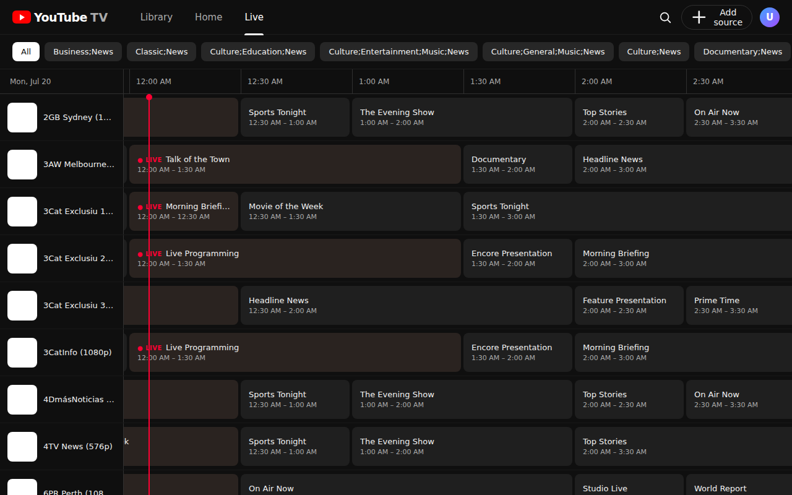
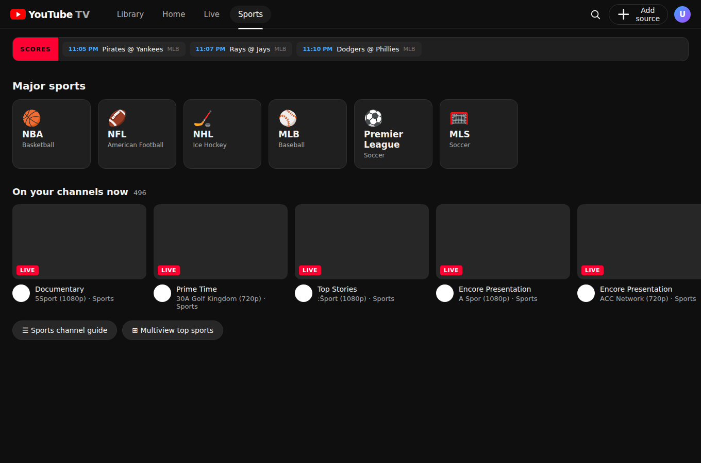
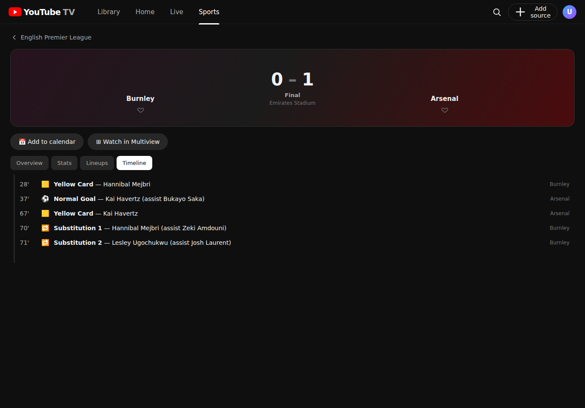
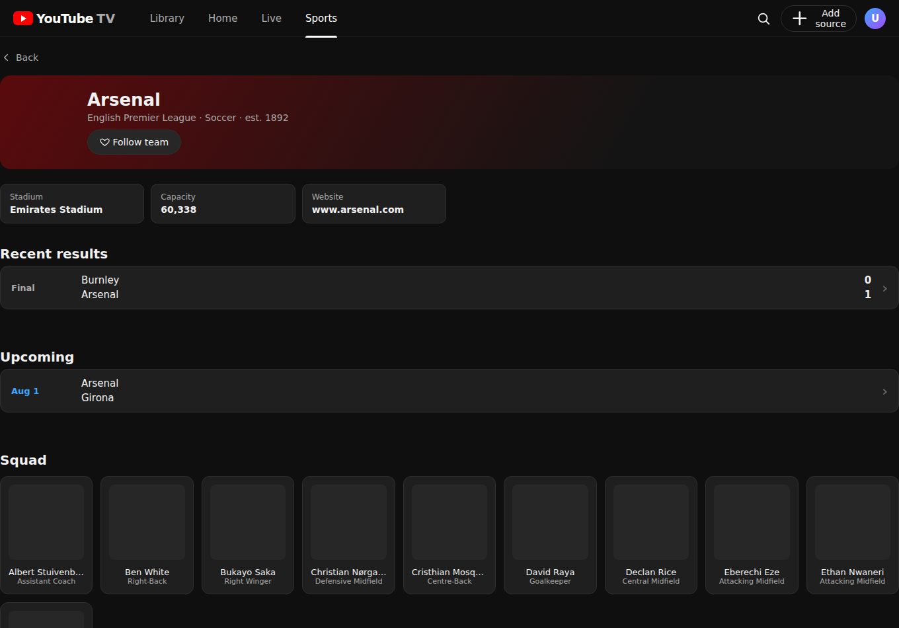

# YouTube TV — IPTV / M3U / M3U8 / Xtream Codes Player

A full, working IPTV player with a UI modeled on **YouTube TV** (tv.youtube.com) —
the live‑TV / cable‑replacement experience with **Library · Home · Live** tabs and a
classic **Live Guide** channel grid.

It plays:

- **M3U / M3U8** playlists — by URL or by uploading a local `.m3u` / `.m3u8` file
- **Xtream Codes** panels — server URL + username + password (live streams)
- HLS (`.m3u8`), MPEG‑TS (`.ts`) live streams, and direct media (`.mp4`, etc.)

…with a real **EPG** (program guide) and a dedicated **Sports** section.






## Why there's a small backend

Browsers block cross‑origin requests to most IPTV servers (no CORS headers), and
can't fetch `http://` streams from an `https://` page. So the app ships with a tiny
Express server that:

- proxies playlist/Xtream API fetches (`/api/fetch`, `/api/json`)
- fetches EPG feeds and transparently gunzips `.xml.gz` (`/api/epg`)
- relays HLS/TS streams and **rewrites manifest URLs** so nested playlists and
  segments keep flowing through the proxy (`/api/stream`)
- serves the built React app in production

Everything the browser talks to is same‑origin. Nothing is stored server‑side; your
playlists, favorites and history live in `localStorage`.

## Run it

```bash
npm install

# Development (Vite on :5173 + API on :5174, hot reload)
npm run dev
# open http://localhost:5173

# Production (build + single server on :5174)
npm run build
npm start
# open http://localhost:5174
```

Then click **Add source** and paste an M3U URL, upload a file, or enter your Xtream
Codes credentials.

### Try it instantly

Any public M3U works, e.g. from the open [iptv‑org](https://github.com/iptv-org/iptv)
project:

```
https://iptv-org.github.io/iptv/categories/news.m3u
```

## Features

- **Live Guide** — YouTube‑TV‑style grid: sticky channel rail with logos + numbers,
  scrollable time header, program blocks, a live red "now" line, and category filter
  chips.
- **EPG (XMLTV)** — real program data with titles, times, descriptions and a ● LIVE
  marker on the current show. Sources:
  - **M3U** — auto‑detected from the playlist header (`url-tvg` / `x-tvg-url`), or set
    an EPG URL manually in *Add source*. Plain `.xml` and gzipped `.xml.gz` feeds are
    both supported (the backend gunzips transparently).
  - **Xtream Codes** — pulled automatically from the panel's `xmltv.php`.
  Channels with no EPG fall back to a stable synthesized schedule so the grid is never
  empty.
- **Sports** — a full sports hub built on a free public API
  ([TheSportsDB](https://www.thesportsdb.com/)):
  - **Major sports** grid — NBA, NFL, NHL, MLB, Premier League, MLS.
  - Pick a sport → **all its games** (browse by day) → click a game → the **channels
    airing it** (matched from your EPG by team names, with a sport‑based fallback) plus
    **live stats** (score, status, venue, badges) from the API.
  - Also finds sports across your own channel names/categories/EPG for a "on your
    channels now" shelf and a sports‑only channel guide.

  Extra features layered on top:
  1. **Live score ticker** — auto‑refreshing scores across every league.
  2. **Favorite teams** — star teams; a "Your teams — next up" rail shows their next games.
  3. **Game reminders** — set a bell on an upcoming game; get an in‑app "starting soon" alert.
  4. **Standings** — a per‑league standings table.
  5. **Multiview** — watch up to 4 games/channels at once in a grid; click a tile (or press 1–4) to move audio to it.
  6. **Multi‑day schedule browser** — day chips (yesterday … +4 days) to scan each sport's full slate.
  7. **Box‑score stats** — per‑match stat bars (shots, possession, …) on a Stats tab, live‑refreshed.
  8. **Lineups** — starting XI / roster per side, each player clickable through to their profile.
  9. **Play‑by‑play timeline** — goals, cards and subs minute‑by‑minute, auto‑updating for live games.
  10. **Recent form & highlights** — W/L/D form pills for both sides plus an embedded highlights reel.
  11. **Team pages** — badge, stadium, capacity, description, recent results, upcoming fixtures and full squad.
  12. **Player pages** — photo, position, nationality, bio — reached from lineups, rosters or search.
  13. **Global sports search** — find any team, player or match across the API.
  14. **"Live now" hub** — one auto‑refreshing screen of every game live across all sports.
  15. **"My Sports" dashboard** — followed teams, their next games, and your reminders (with **.ics calendar export**).

  Playback extras that pair with sports: **Picture‑in‑Picture**, a **floating mini‑player** (keep watching
  while you browse), **live DVR** (rewind / start‑over / jump‑to‑live), and **keyboard shortcuts**
  (space, f, m, i, ←/→, l).
- **Home** — featured hero + horizontal shelves (Continue watching, Favorites, and a
  row per category).
- **Search** — instant filtering across every channel in every source.
- **Library** — manage your playlists / accounts and see your favorites.
- **Player** — full‑screen with HLS.js + mpegts.js, favorite toggle, live pill,
  loading and graceful error states. `Esc` closes it.
- Favorites and "continue watching" history persisted locally.

## Tech

React + Vite frontend · Express proxy backend · hls.js · mpegts.js. Sports data from
the free [TheSportsDB](https://www.thesportsdb.com/) API (proxied). No accounts,
no database, no telemetry.

## Notes / limitations

- A channel only plays if its stream is online and reachable from wherever the
  backend runs (geo‑blocking and provider auth still apply).
- Some providers encrypt or token‑gate segments; those may not play in a browser.
- This project ships **no** channels or credentials — you bring your own legally
  obtained playlist or account.
